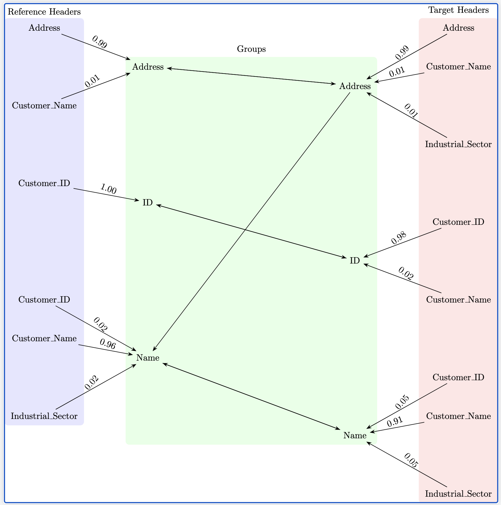

# AI VLookUp

This project provides a multi-data structure backed approach to tackle efficient fuzzy matching in tables; with its engine backed by HashMaps, Tokenization, Jaccard, and Damerau plus small group sorting this approach is capable of creating its own database for fuzzy look up; which is then used to query itself in order to solve the most optimal mapping between entries of two different tables.

## Use case

Let’s say we have the following tables: 1.  [Fuzzy_Table](./Sample_Dataset/Primary_Reference_Table.csv) and the 2. [Reference_Table](./Sample_Dataset/Secondary_Data.csv). The first table is the one we want to "clean" or fill based on the second table that provides the expected actual values per entry. In this case, we attempt to find the ID each entry based on the values of other columns. The challenge here is that for some entry each column may or may not have data necessary to perform an "ordinary" V Look Up by itself; additionally, it may contain data but this text could be not exact matching to the valid one. Therefore, our objective here is per each entry (row) use all the non-empty columns as reference points.

Without getting into deeper details (check documentation for more) the functionality of this program is to perform a many-to-many (in regards to the columns) weighted fuzzy matching per each incomplete entry against a complete or valid reference table.

## Dependencies and Installation

Verify java version > 1.8

```console
java -version
```

Install maven

```console
brew install maven
```

The package dependencies may be found under [Engine/pom.xml](./Engine/pom.xml)

You may build the program (JAR) from source code as a Maven project.

## Example usage

Continuing our example from the use case. Let's say we want to find the Customer_ID for each entry in the  [Fuzzy_Table](./Sample_Dataset/Primary_Reference_Table.csv). However, if we see our table there might be values that appear in the incorrect columns. Therefore, we plot the mapping between columns across both tables as below.

<span id="graph1"></span>

  

​			         Graph 1: Default mapping configuration 

## Set-up

### Download code

```console
git clone https://github.com/luislascano01/AI_VLookUp
```

```console
cd AI_VLookUp
```

### Build JAR

```console
cd Engine
mvn clean install
```

### Custom run configuration

Reference and edit [sample configuration](./Engine/src/main/resources/header_configuration.yaml) according to excel tables to be processed.

This configuration includes header mappings –as seen on the image– as well as excel workbooks paths, operating directory path, and secondary data columnwise RegEx set.

To view sample from terminal:

```yaml
cat Engine/src/main/resources/header_configuration.yaml
```

## Execution

### Sample execution

```console
java -jar Engine/target/ai_vlookup-0.0.1-SNAPSHOT.jar Engine/src/main/resources/header_configuration.yaml
```

Find output as

```console
./OperatingDir/results.csv 
```

### Custom execution

Modify the header_configuration.yaml according to your needs. Refer to [Graph 1](#graph1) to understand the mapping – soft-max is applied to weights. Such [graph](#graph1) corresponds to the mapping of the [sample YAML configuration](./Engine/src/main/resources/header_configuration.yaml); specifically, the "BackboneConfiguration".

```console
java -jar Engine/target/ai_vlookup-0.0.1-SNAPSHOT.jar custom_config.yaml
```

## Copyright Notice

© [2025] [Luis Lascano]. All rights reserved.

Open to use as is through instructed installation for personal use. No permission authorized to copy, modify, or distribute this software (or part of it) and its documentation for any purpose without the express written permission of the copyright holder.
